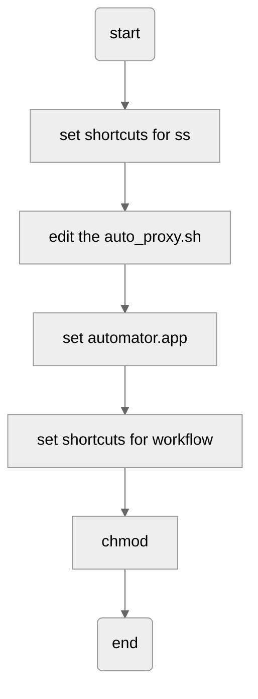

# apple

## 连续按键


```
defaults write NSGlobalDomain ApplePressAndHoldEnabled -boolean false
defaults write -g ApplePressAndHoldEnabled -boolfalse
```

## 加快光标移动速度


```
defaults write NSGlobalDomain ApplePressAndHoldEnabled -bool false
defaults write NSGlobalDomain KeyRepeat -int 2
defaults write NSGlobalDomain InitialKeyRepeat -int 10
```

恢复默认


```
defaults delete NSGlobalDomain KeyRepeat
defaults delete NSGlobalDomain InitialKeyRepeat
```


## get process id from port


```
sudo lsof -i -P | grep LISTEN | grep :8080
```


## 移除左右滑动功能

valid url

http://magicprefs.com/

invalid

```bash
defaults write com.apple.dt.Xcode AppleEnableMouseSwipeNavigateWithScrolls -bool NO
defaults write com.apple.driver.AppleBluetoothMultitouch.mouse MouseHorizontalScroll -bool NO
defaults write .GlobalPreferences com.apple.driver.AppleBluetoothMultitouch.mouse MouseHorizontalScroll -bool NO
```


## ss-local

the whole flow




set shortcuts for command which turn on proxy auto discovery, to command control shift "a"

vi ~/auto_proxy.sh

```
#!/bin/bash

networksetup -setproxyautodiscovery USB\ 10/100/1000\ LAN on
```

chmod +x auto_proxy.sh

open automator.app

select quickly operation

select "run AppleScript" Application

no input

add below command

```
tell application "System Events"
	keystroke "a" using {command down, shift down, control down}
	delay 1
	do shell script "/bin/bash ~/auto_proxy.sh"
end tell
```

type command + s

naming to ss-proxy

open system settings, select keyboard, shortcuts, services, common, assign shortcuts(control command z) for ss-proxy


set direct Accessibility privileges

add AppleScript Utility and Automator

To add AppleScript Utility app, click the + button on Accessibility, then navigate to (a shortcut is CMD+SHIFT+G)

```
/System/Library/CoreServices
```

then open the application called AppleScript Utility, also need add other applications.

chmod 

```
chmod +x ~/Library/Services/ss-proxy.workflow
```


**setup auto proxy enable on command**

```
networksetup -setproxyautodiscovery USB\ 10/100/1000\ LAN on
networksetup -setproxyautodiscovery USB\ 10/100/1000\ LAN off
```

**shadowsocks path**

~/Library/Application Support/ShadowsocksX-NG-R8


**install shadowsocks library**

```
brew install shadowsocks-libev v2ray-plugin
```

To restart shadowsocks-libev after an upgrade:

```
brew services restart shadowsocks-libev
```

Or, if you don't want/need a background service you can just run:

```
/usr/local/opt/shadowsocks-libev/bin/ss-local -c /usr/local/etc/shadowsocks-libev.json
```


**view process of shadowsocks**

```
lsof -iTCP -sTCP:LISTEN -n -P
```

output

```
COMMAND     PID         USER   FD   TYPE             DEVICE SIZE/OFF NODE NAME
Shadowsoc 65979 idlepig   11u  IPv4 0xd38e381a21fb3505      0t0  TCP 127.0.0.1:8090 (LISTEN)
Shadowsoc 65979 idlepig   12u  IPv6 0xd38e3823bb1a9aad      0t0  TCP [::1]:8090 (LISTEN)
ss-local  75261 idlepig    6u  IPv4 0xd38e381a2851e505      0t0  TCP 127.0.0.1:1086 (LISTEN)
privoxy   75265 idlepig    3u  IPv4 0xd38e381a284d0505      0t0  TCP 127.0.0.1:1087 (LISTEN)
```

**check whether turn on traffic**

```
curl --socks5 127.0.0.1:1086 http://cip.cc
```


**command list for get proxy settings**

```
$ system_profiler SPNetworkDataType # get whole network config
$ networksetup -listallnetworkservices # list all network device
$ networksetup -getwebproxy Wi-Fi # get system proxy config of special network device

```


**change terminal proxy automatically for mac**

```
#!/bin/zsh
# Auto configure zsh proxy env based on system preferences
# Sukka (https://skk.moe)

# Cache the output of scutil --proxy
__ZSH_OSX_AUTOPROXY_SCUTIL_PROXY=$(scutil --proxy)

# Pattern used to match the status
__ZSH_OSX_AUTOPROXY_HTTP_PROXY_ENABLED_PATTERN="HTTPEnable : 1"
__ZSH_OSX_AUTOPROXY_HTTPS_PROXY_ENABLED_PATTERN="HTTPSEnable : 1"
__ZSH_OSX_AUTOPROXY_FTP_PROXY_ENABLED_PATTERN="FTPSEnable : 1"
__ZSH_OSX_AUTOPROXY_SOCKS_PROXY_ENABLED_PATTERN="SOCKSEnable : 1"

__ZSH_OSX_AUTOPROXY_HTTP_PROXY_ENABLED=$__ZSH_OSX_AUTOPROXY_SCUTIL_PROXY[(I)$__ZSH_OSX_AUTOPROXY_HTTP_PROXY_ENABLED_PATTERN]
__ZSH_OSX_AUTOPROXY_HTTPS_PROXY_ENABLED=$__ZSH_OSX_AUTOPROXY_SCUTIL_PROXY[(I)$__ZSH_OSX_AUTOPROXY_HTTPS_PROXY_ENABLED_PATTERN]
__ZSH_OSX_AUTOPROXY_FTP_PROXY_ENABLED=$__ZSH_OSX_AUTOPROXY_SCUTIL_PROXY[(I)$__ZSH_OSX_AUTOPROXY_FTP_PROXY_ENABLED_PATTERN]
__ZSH_OSX_AUTOPROXY_SOCKS_PROXY_ENABLED=$__ZSH_OSX_AUTOPROXY_SCUTIL_PROXY[(I)$__ZSH_OSX_AUTOPROXY_SOCKS_PROXY_ENABLED_PATTERN]

# http proxy
if (( $__ZSH_OSX_AUTOPROXY_HTTP_PROXY_ENABLED )); then
    __ZSH_OSX_AUTOPROXY_HTTP_PROXY_SERVER=${${__ZSH_OSX_AUTOPROXY_SCUTIL_PROXY#*HTTPProxy : }[(f)1]}
    __ZSH_OSX_AUTOPROXY_HTTP_PROXY_PORT=${${__ZSH_OSX_AUTOPROXY_SCUTIL_PROXY#*HTTPPort : }[(f)1]}
    export http_proxy="http://${__ZSH_OSX_AUTOPROXY_HTTP_PROXY_SERVER}:${__ZSH_OSX_AUTOPROXY_HTTP_PROXY_PORT}"
    export HTTP_PROXY="${http_proxy}"
fi
# https_proxy
if (( $__ZSH_OSX_AUTOPROXY_HTTPS_PROXY_ENABLED )); then
    __ZSH_OSX_AUTOPROXY_HTTPS_PROXY_SERVER=${${__ZSH_OSX_AUTOPROXY_SCUTIL_PROXY#*HTTPSProxy : }[(f)1]}
    __ZSH_OSX_AUTOPROXY_HTTPS_PROXY_PORT=${${__ZSH_OSX_AUTOPROXY_SCUTIL_PROXY#*HTTPSPort : }[(f)1]}
    export https_proxy="http://${__ZSH_OSX_AUTOPROXY_HTTPS_PROXY_SERVER}:${__ZSH_OSX_AUTOPROXY_HTTPS_PROXY_PORT}"
    export HTTPS_PROXY="${https_proxy}"
fi
# ftp_proxy
if (( $__ZSH_OSX_AUTOPROXY_FTP_PROXY_ENABLED )); then
    __ZSH_OSX_AUTOPROXY_FTP_PROXY_SERVER=${${__ZSH_OSX_AUTOPROXY_SCUTIL_PROXY#*FTPProxy : }[(f)1]}
    __ZSH_OSX_AUTOPROXY_FTP_PROXY_PORT=${${__ZSH_OSX_AUTOPROXY_SCUTIL_PROXY#*FTPPort : }[(f)1]}
    export ftp_proxy="http://${__ZSH_OSX_AUTOPROXY_FTP_PROXY_SERVER}:${__ZSH_OSX_AUTOPROXY_FTP_PROXY_PORT}"
    export FTP_PROXY="${ftp_proxy}"
fi
# all_proxy
if (( $__ZSH_OSX_AUTOPROXY_SOCKS_PROXY_ENABLED )); then
    __ZSH_OSX_AUTOPROXY_SOCKS_PROXY_SERVER=${${__ZSH_OSX_AUTOPROXY_SCUTIL_PROXY#*SOCKSProxy : }[(f)1]}
    __ZSH_OSX_AUTOPROXY_SOCKS_PROXY_PORT=${${__ZSH_OSX_AUTOPROXY_SCUTIL_PROXY#*SOCKSPort : }[(f)1]}
    export all_proxy="http://${__ZSH_OSX_AUTOPROXY_SOCKS_PROXY_SERVER}:${__ZSH_OSX_AUTOPROXY_SOCKS_PROXY_PORT}"
    export ALL_PROXY="${all_proxy}"
elif (( $__ZSH_OSX_AUTOPROXY_HTTP_PROXY_ENABLED )); then
    export all_proxy="${http_proxy}"
    export ALL_PROXY="${all_proxy}"
fi
```


## minikube mirrors

minikube start --image-mirror-country=cn   --iso-url=https://kubernetes.oss-cn-hangzhou.aliyuncs.com/minikube/iso/minikube-v1.6.2.iso  --registry-mirror=https://mhzm7ggy.mirror.aliyuncs.com  --image-repository=registry.cn-hangzhou.aliyuncs.com/google_containers


## set mirrors for brew


```bash
git -C "$(brew --repo)" remote set-url origin https://mirrors.ustc.edu.cn/brew.git

git -C "$(brew --repo homebrew/core)" remote set-url origin https://mirrors.ustc.edu.cn/homebrew-core.git

git -C "$(brew --repo homebrew/cask)" remote set-url origin https://mirrors.ustc.edu.cn/homebrew-cask.git

if [ $SHELL = "/bin/bash" ] 
then 
    echo 'export HOMEBREW_BOTTLE_DOMAIN=https://mirrors.ustc.edu.cn/homebrew-bottles/' >> ~/.bash_profile
    source ~/.bash_profile
elif [ $SHELL = "/bin/zsh" ]
then
    echo 'export HOMEBREW_BOTTLE_DOMAIN=https://mirrors.ustc.edu.cn/homebrew-bottles/' >> ~/.zshrc
    source ~/.zshrc
fi

brew update
```

**restore to origin mirror**

```bash
git -C "$(brew --repo)" remote set-url origin https://github.com/Homebrew/brew.git

git -C "$(brew --repo homebrew/core)" remote set-url origin https://github.com/Homebrew/homebrew-core.git

git -C "$(brew --repo homebrew/cask)" remote set-url origin https://github.com/Homebrew/homebrew-cask.git


# delete the whole line contains HOMEBREW_BOTTLE_DOMAIN in ~/.bash_profile or ~/.zshrc

brew update
```


you can try commands below one by one if invalid

```bash
brew doctor
brew update-reset
brew update
```


## hide your computer name in ZSH/BASH

vim .zshrc

```bash
export PS1="[~]$ "; clear;
```

## close multiple users in login page


```bash
sudo defaults write /Library/Preferences/com.apple.loginwindow SHOWOTHERUSERS_MANAGED -bool FALSE
```

## open sidecar by force

```bash
defaults write com.apple.sidecar.display AllowAllDevices -bool true
defaults write com.apple.sidecar.display hasShownPref -bool true
```


## apple power adapter extension string

https://www.apple.com.cn/shop/product/MK122CH/A


## set mouse spped

```bash
defaults write -g com.apple.mouse.scaling 18
```

wheel speed

```bash
defaults write -g com.apple.scrollwheel.scaling 1.2
```


