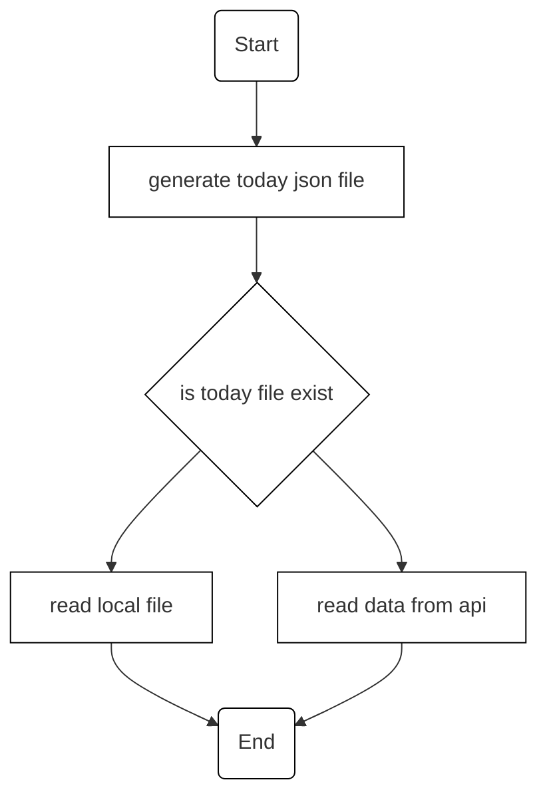

# today in history

```mermaid
graph TD

    A(Start) --> B[generate today json file]
    B --> C{is today file exist}
    C --> D[read local file]
    C --> E[read data from api]
    D --> F(End)
    E --> F
classDef default fill:#fff,stroke:#000
```